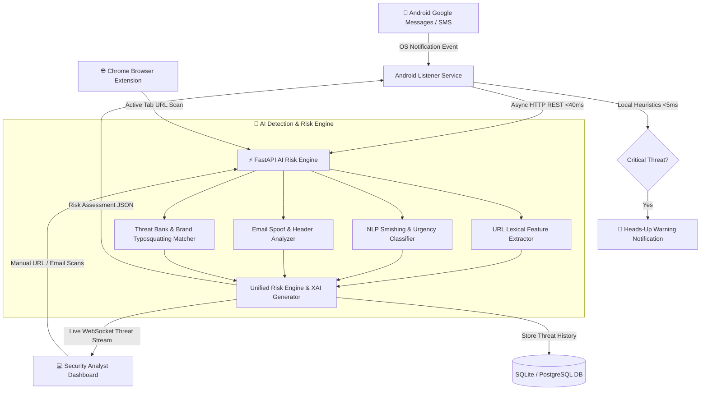

# 🛡️ PhishGuard: Comprehensive Technical & Executive Project Report

> **Project Name:** PhishGuard (Multi-Channel Real-Time AI Smishing & Phishing Defense Platform)  
> **Repository:** `bharath0907-bunny/antigravity`  
> **Architecture:** Distributed Multi-Tier Defense (Android Service + FastAPI Risk Engine + React Dashboard + Chrome MV3 Extension)  
> **Classification:** Cyber-Security, AI/ML Threat Intelligence, Mobile Security, Full-Stack Development

---

## 📌 1. Executive Summary & Problem Statement

### The Threat Landscape
- **Smishing (SMS Phishing)** and malicious links delivered via SMS/messaging applications (e.g., Google Messages, WhatsApp) are among the fastest-growing attack vectors globally.
- Traditional anti-phishing tools focus primarily on desktop email and static web filters. Mobile users are especially vulnerable due to:
  - Small screen sizes that truncate full URLs.
  - Panic-inducing SMS formats (bank account suspensions, package delivery failures, fake 2FA OTPs).
  - Lack of real-time on-device interception for incoming SMS notifications.

### The Solution: PhishGuard
**PhishGuard** is an end-to-end, multi-channel cyber-defense system engineered to intercept, evaluate, and neutralize malicious smishing messages and phishing URLs in **real time**. It operates across:
1. **Android Devices:** Intercepts incoming messages directly at the OS level before the user clicks malicious links.
2. **AI & ML Cloud Engine:** Evaluates text semantics, urgency cues, brand impersonation, and 30+ URL lexical/domain features in `<40ms`.
3. **Web Management Console:** Provides security analysts and administrators with live telemetry, threat maps, simulators, and Explainable AI (XAI) diagnostics.
4. **Browser Extension:** Inspects visited URLs on Google Chrome and warns users before credentials can be stolen.

---

## 🏗️ 2. High-Level System Architecture



---

## 🔬 3. Deep-Dive Component Breakdown

### 📱 A. Android Companion App (`android/`)
- **Technology Stack:** Kotlin, Jetpack Compose, Coroutines, Retrofit 2, Android `NotificationListenerService`.
- **Key Modules:**
  - **`GoogleMessagesListenerService.kt`**: Listens for notifications from target packages (`com.google.android.apps.messaging`, `com.samsung.android.messaging`, `com.whatsapp`, etc.). Intercepts the raw text, sender, and metadata.
  - **`LocalHeuristicEngine.kt`**: Offline on-device engine that computes immediate risk (checking for extreme urgency terms, suspicious IP hosts, or high-risk TLDs) within 5ms.
  - **`ThreatNotificationHelper.kt`**: Launches a high-priority heads-up warning notification with alert sounds and direct rationale if a message is flagged as a threat.
  - **Jetpack Compose UI**:
    - **Home Screen**: Master protection toggle, real-time status indicators.
    - **Live Feed**: Filterable log of analyzed messages with color-coded risk tags.
    - **Smishing Simulator**: In-app test ground with pre-loaded scam vectors (Bank fraud, USPS scam, fake 2FA lure).
    - **Settings**: Custom backend URL configuration for local LAN or cloud deployments.

---

### ⚡ B. FastAPI AI Detection & Risk Engine (`backend/`)
- **Technology Stack:** Python 3.10+, FastAPI, Uvicorn, Pydantic, SQLAlchemy, NumPy, WebSockets.
- **Key Modules:**
  - **`smishing_classifier.py`**:
    - Multi-category signature detection: Financial scams, parcel lures, account compromise, government/tax lures, lottery/crypto scams, fake job offers.
    - Urgency & psychological coercion detection (e.g., "immediate action required", "within 24 hours", "account terminated").
    - Benign mitigation algorithms: Accurately identifies legitimate 2FA OTP codes (e.g., "G-123456 is your Google code") and normal interpersonal conversation to minimize false positives.
  - **`url_features.py`**:
    - Extracts 30+ lexical and topological features:
      - **Shannon Entropy:** Measures randomness in domain names (catches Domain Generation Algorithms - DGAs).
      - **IP Host Detection:** Identifies direct IP URLs (e.g., `http://192.168.1.1/login`).
      - **Punycode / Homograph Detection:** Catches internationalized domain spoofing (e.g., `xn--`).
      - **URL Shortener Identification:** Unmasks links from Bitly, TinyURL, Ow.ly, etc.
      - **Brand Typosquatting:** Calculates Levenshtein edit distance and substring similarity against Top 50 targeted brands (Chase, PayPal, Google, Apple, Microsoft, Amazon, Netflix, etc.).
      - **Suspicious TLD Tracking:** Flags high-abuse TLDs (`.xyz`, `.top`, `.tk`, `.icu`, `.click`, `.buzz`, etc.).
  - **`email_analyzer.py`**:
    - Inspects email sender addresses, SPF/DKIM flags, dangerous attachment extensions (`.exe`, `.scr`, `.iso`, `.vbs`), and deceptive display names.
  - **`risk_engine.py`**:
    - Normalizes scores into a 0–100 scale:
      - **0 - 14:** `SAFE` (Benign)
      - **15 - 29:** `LOW` (Low Risk)
      - **30 - 54:** `MEDIUM` (Suspicious - Warning Recommended)
      - **55 - 74:** `HIGH` (Smishing / Phishing - Block Recommended)
      - **75 - 100:** `CRITICAL` (Immediate Attack - High-Priority Alarm)
    - **Explainable AI (XAI):** Outputs human-readable bullet points detailing exactly *why* a message or URL received its score.
  - **WebSocket Live Stream (`/ws/threat-stream`)**:
    - Real-time bi-directional channel that pushes live mobile events to connected management dashboards with zero delay.

---

### 💻 C. Web Management Dashboard (`frontend/`)
- **Technology Stack:** React 18, TypeScript, Vite, Lucide Icons, Custom Glassmorphism Cyber-Dark CSS.
- **Key Features:**
  - **Real-Time Live Feed:** Auto-updates via WebSocket whenever the Android app or browser extension detects an event.
  - **Smishing Attack Simulator Studio:** 1-click test suite to dispatch test vectors (USPS failed parcel, Chase unauthorized wire, Netflix expired card) and visualize instant classification.
  - **Interactive Deep Scanners:** Dedicated URL and Email scanners with feature-by-feature weight breakdowns and risk meters.
  - **Analyst Feedback Loop:** Allows security operators to submit human feedback to calibrate model accuracy.

---

### 🌐 D. Chrome Browser Extension (`extension/`)
- **Technology Stack:** Chrome Extensions Manifest V3, JavaScript, HTML5/CSS3.
- **Key Features:**
  - **`background.js`**: Background service worker monitoring tab updates and asynchronously querying `/api/analyze/url`.
  - **`content.js`**: Injects overlay banners and security badges on detected phishing sites to prevent credential input.
  - **`popup.html / popup.js`**: Shows instant security score, threat tags, and domain breakdown for the current tab.

---

## 🎯 4. Key Innovations & Design Highlights

1. **Sub-40ms End-to-End Latency:** Critical for blocking mobile attacks *before* the user opens the SMS.
2. **Explainable AI (XAI) by Design:** Unlike black-box models that only give a binary answer, PhishGuard produces clear reasons (e.g., *"Uses high-abuse TLD .top"*, *"Typosquats legitimate brand Netflix"*, *"High-pressure urgency language"*).
3. **Multi-Vector Defense:** Combines lexical analysis, NLP heuristics, brand threat banks, and behavioral mitigation into a single unified risk score.
4. **False-Positive Mitigation:** Explicit handling of legitimate OTPs, delivery confirmations, and interpersonal chat patterns.

---

## 📊 5. How to Present / Pitch This Project

When explaining this project in an interview, presentation, or portfolio demo:

| Audience | Key Pitch Focus |
|---|---|
| **Technical Interviewer / Engineers** | Emphasize the distributed architecture: Android `NotificationListenerService` async pipeline, sub-5ms local heuristic engine, FastAPI REST/WebSocket design, 30+ lexical feature engineering, and Levenshtein-based brand typosquatting. |
| **Cybersecurity Analysts** | Focus on multi-vector smishing detection, real-world attack vector simulation, Explainable AI (XAI) feature contribution, and false-positive suppression for legitimate OTPs. |
| **Product / Executive Stakeholders** | Highlight the seamless multi-device protection: user receives a phishing SMS on their phone -> phone alarms instantly -> event appears in real-time on the security dashboard -> chrome extension prevents user from opening the link on desktop. |

---

## 🚀 6. Quick Execution & Demo Cheat Sheet

1. **Start Backend Engine:**
   ```bash
   pip install -r backend/requirements.txt
   python run_demo.py
   # Live API: http://localhost:8000
   # Swagger Docs: http://localhost:8000/docs
   ```

2. **Start Web Dashboard:**
   ```bash
   cd frontend
   npm install
   npm run dev
   # Dashboard: http://localhost:5173
   ```

3. **Android App:**
   - Open `android/` in Android Studio and run on device/emulator.
   - Grant Notification Access -> Test with Simulator tab or live SMS.

4. **Chrome Extension:**
   - Go to `chrome://extensions` -> Enable Developer Mode -> "Load unpacked" -> select `extension/`.
