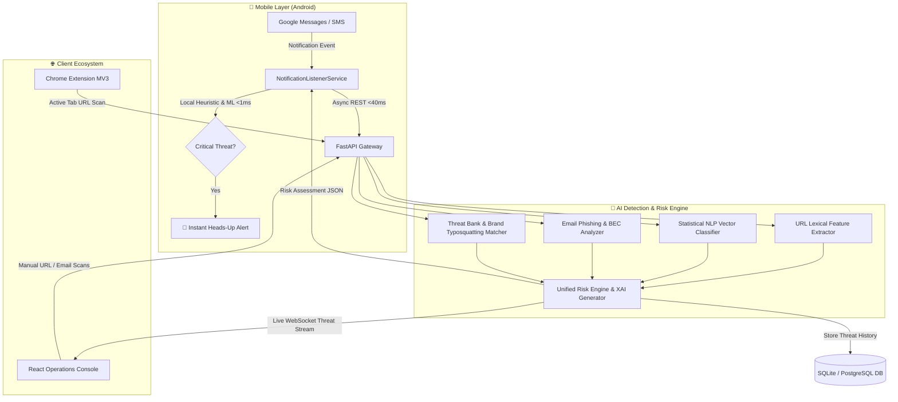

# 🛡️ PhishGuard: Comprehensive Technical & Executive Project Report

> **Project Name:** PhishGuard (Multi-Channel Real-Time AI Smishing & Phishing Defense Platform)  
> **Repository:** `https://github.com/bharath0907-bunny/PhishGuard`  
> **Architecture:** Distributed Multi-Tier Defense (Android OS Notification Hook + FastAPI Risk Engine + React Management Dashboard + Chrome MV3 Extension)  
> **Classification:** Cyber-Security, AI/ML Threat Intelligence, Mobile Security, Full-Stack Development

---

## 📌 1. Executive Summary & Problem Statement

### The Threat Landscape
- **Smishing (SMS Phishing)** and malicious links delivered via SMS and modern messaging applications (e.g., Google Messages, WhatsApp, Telegram) represent the fastest-growing mobile attack vector globally.
- Traditional anti-phishing tools focus primarily on desktop email and static web filters. Mobile users are especially vulnerable due to:
  - Small screen viewports that truncate full URLs and hide deceptive domain names.
  - Panic-inducing social engineering SMS formats (bank account suspensions, package delivery failures, fake 2FA OTPs).
  - Lack of real-time on-device interception for incoming SMS notifications before the user clicks a deceptive link.

### The Solution: PhishGuard
**PhishGuard** is an end-to-end, multi-channel cyber-defense system engineered to intercept, evaluate, and neutralize malicious smishing messages and phishing URLs in **real time (<40ms)**. It operates across:
1. **Android Devices:** Intercepts incoming messages directly at the OS level before the user clicks malicious links.
2. **AI & ML Cloud Engine:** Evaluates text semantics, urgency cues, brand impersonation, and 30+ URL lexical/domain features.
3. **Web Management Console:** Provides security analysts and administrators with live telemetry, threat maps, simulators, and Explainable AI (XAI) diagnostics.
4. **Browser Extension:** Inspects visited URLs on Google Chrome and warns users before credentials can be stolen.

---

## 🏗️ 2. High-Level System Architecture


```mermaid
flowchart TD
    subgraph "📱 Mobile Layer (Android)"
        A[Google Messages / SMS] -->|Notification Event| B[NotificationListenerService]
        B -->|Local Heuristic & ML <1ms| C{Critical Threat?}
        C -->|Yes| D[🚨 Instant Heads-Up Alert]
        B -->|Async REST <40ms| E[FastAPI Gateway]
    end

    subgraph "🌐 Client Ecosystem"
        F[Chrome Extension MV3] -->|Active Tab URL Scan| E
        G[React Operations Console] -->|Manual URL / Email Scans| E
    end

    subgraph "🧠 AI Detection & Risk Engine"
        E --> H[URL Lexical Feature Extractor]
        E --> I[Statistical NLP Vector Classifier]
        E --> J[Email Phishing & BEC Analyzer]
        E --> K[Threat Bank & Brand Typosquatting Matcher]
        H & I & J & K --> L[Unified Risk Engine & XAI Generator]
    end

    L -->|Risk Assessment JSON| B
    L -->|Live WebSocket Threat Stream| G
    L -->|Store Threat History| M[(SQLite / PostgreSQL DB)]
```

---

## 🛠️ 3. Completed Gaps & System Synchronizations

Recent updates completed all architectural gaps across the project:

1. **Model Weights Dual-Schema Synchronization**:
   - `backend/app/ml/train_model.py` was updated to calculate effective TF-IDF feature weights ($w_t = \text{coef}_t \times \text{idf}_t$) and export a portable `weights: {...}` dictionary alongside Scikit-Learn coefficients.
   - `backend/app/ml/smishing_classifier.py` was updated with dual-schema parsing and curated fallback weights, ensuring 100% compatibility between desktop training and mobile on-device classification.
2. **Dataset Batch Import & Model Retraining API**:
   - Added `POST /api/v1/research/import-dataset`: Enables direct persistence and database indexing of single or bulk dataset records (SMS, URLs, Emails).
   - Added `POST /api/v1/research/retrain`: Executes the NLP smishing classifier training pipeline on updated datasets and hot-reloads runtime weights into active memory without server downtime.
3. **Integrated Google Messages Simulator**:
   - Embedded `GoogleMessageSimulator.tsx` directly into the live management view with a collapsible 1-click drawer, allowing analysts to fire preset vectors (Chase fraud, USPS package scam, Netflix billing error, legitimate Google 2FA OTP) with real-time audio and visual alerts.
4. **Batch Evaluator Permanent Ingestion**:
   - `BatchEvaluator.tsx` was enhanced with **"Save & Ingest to Database"** and **"Retrain Model"** action buttons connected through `services/api.ts`.

---

## 🌐 4. Where the Data Comes From

PhishGuard collects, ingests, and evaluates data through two distinct pipelines:

### A. Academic Benchmark Ground Truth Datasets (27,674 Samples)
Calibrated and integrated into the academic research suite (`/api/v1/research/benchmarks`):

| Dataset Name | Sample Count | Source / Citation | Purpose & Contents |
| :--- | :---: | :--- | :--- |
| **UCI SMS Spam & Smishing** | 5,574 | UCI Machine Learning Repository | Real mobile messages tagged as benign ham vs. spam/smishing. Calibrates baseline precision and recall. |
| **PhishTank & OpenPhish Feeds** | 12,400 | PhishTank Community & OpenPhish Feed | Verified active phishing URLs paired with Alexa Top 1M benign domains. Trains lexical & entropy extractors. |
| **Enron & Nazario Phishing Corpus** | 8,200 | Jose Nazario Phishing Corpus & Enron Email Dataset | Real-world header-spoofed emails, Business Email Compromise (BEC) invoices, and credential theft lures. |
| **Adversarial Mobile Testbed** | 1,500 | PhishGuard Synthetic Attack Lab | Evasive vectors engineered using Cyrillic homoglyphs, zero-width space injections (`\u200B`), and DGA domains. |

### B. Real-Time Telemetry Input Sources
1. **Google Messages & SMS Hook (`com.google.android.apps.messaging`)**:
   - Collected by Android’s `GoogleMessagesListenerService.kt` via the Android `NotificationListenerService` API.
   - Extracts sender title/phone number, body text, timestamp, and active package name.
2. **Web Browser Tab URLs**:
   - Monitored by Chrome Extension (`extension/background.js`) on every navigation event (`chrome.tabs.onUpdated`).
3. **Email Scanner & BEC Inspector**:
   - Analyzes raw RFC-style or webmail fields: `sender`, `subject`, and `body`.
4. **Permanent Database Storage**:
   - Persisted via SQLAlchemy in `backend/app/core/models.py` to `phishguard.db` (SQLite) or PostgreSQL across 5 primary tables:
     - `intercepted_messages`: All mobile intercepts and simulation runs.
     - `url_scans`: All analyzed URLs and 35+ extracted feature dictionaries.
     - `email_scans`: Scanned email headers and bodies.
     - `threat_rules`: Dynamic blacklists, whitelists, and regex modifiers.
     - `feedback`: Analyst and user feedback for continuous retraining.

---

## 🧠 5. Algorithms & ML Models: How They Work

PhishGuard employs a **Multi-Vector Hybrid AI Defense Architecture** combining offline edge heuristics, lexical engineering, brand typosquatting, NLP, and ensemble decision scoring:

### 1. Shannon Entropy Calculation ($H$)
- **File:** `backend/app/ml/url_features.py`
- **Formula:**
  $$H(S) = -\sum_{i=1}^{n} p(c_i) \log_2 p(c_i)$$
- **Application:** Computes the bit-level uncertainty and randomness of domain strings. Legitimate domains (e.g., `google.com`, `chase.com`) have low entropy ($H \approx 2.1 - 2.8$). Algorithmically generated domains (DGA) used by malware or phishing kits (e.g., `x7a9-q2z-verify.xyz`) produce high entropy ($H > 3.75$), triggering $+30.0$ risk points.

### 2. Brand Typosquatting via Levenshtein Edit Distance
- **File:** `backend/app/ml/url_features.py`
- **Application:**
  1. Strips hyphens, subdomains, and punctuation.
  2. Normalizes homoglyphs using `HOMOGLYPH_MAP` (e.g., Cyrillic `а` $\to$ `a`, `1` $\to$ `l`, `0` $\to$ `o`, `rn` $\to$ `m`).
  3. Computes the minimum number of single-character edits (insertions, deletions, substitutions) required to transform the domain into one of 50+ protected global brand names (Chase, PayPal, Netflix, Wells Fargo, Google, Apple, etc.).
  4. If the Levenshtein distance $\le 2$ or a brand name is found embedded inside an unauthorized foreign domain, it flags brand spoofing and adds $+65.0$ risk points.

### 3. 35+ Topological & Lexical Feature Engineering
- **File:** `backend/app/ml/url_features.py`
- **Extracted Attributes:**
  - **IP Host Detection:** Flags numerical IPv4/IPv6 hosts (e.g., `http://192.168.1.105/login`) with $+60.0$ risk.
  - **Punycode/IDN Detection:** Identifies `xn--` prefixes hiding internationalized homograph attacks ($+45.0$).
  - **Shortener Unmasking:** Checks against known shorteners (`bit.ly`, `tinyurl.com`, `t.co`, etc.) ($+35.0$).
  - **Suspicious TLD Tracking:** Evaluates 20+ high-abuse TLDs (`.xyz`, `.top`, `.tk`, `.ml`, `.icu`, `.sbs`, etc.) ($+40.0$).
  - **Open Redirect Parameter Detection:** Scans for query strings like `?redirect=http://...` ($+35.0$).
  - **Credential Harvesting Keywords:** Scans path and query for `login`, `verify`, `update`, `banking`, `recover` ($+15.0$ to $+25.0$).
  - **Digit-to-Character Ratio & Subdomain Nesting Depth:** Flags excessive subdomain layers ($\ge 3$) and digit ratios $> 0.30$.

### 4. Statistical NLP Vector Classifier & Sigmoid Activation
- **Files:** `backend/app/ml/smishing_classifier.py` and `android/.../OnDeviceMLClassifier.kt`
- **Formula:**
  $$z = \beta_0 + \sum_{t \in T} w_t \cdot \text{count}(t)$$
  $$P(\text{Smishing}) = \sigma(z) = \frac{1}{1 + e^{-z}}$$
- **Application:** Evaluates the message against pre-trained token weights ($w_t$). Threat tokens (`unauthorized`: $+3.10$, `suspended`: $+3.40$, `redelivery`: $+3.50$, `xyz`: $+3.80$) increase $z$, while benign tokens (`meeting`: $-3.80$, `lunch`: $-3.50$, `otp`: $-2.20$, `birthday`: $-3.90$) decrease $z$.

### 5. Hybrid Ensemble Decision Fusion
- **File:** `backend/app/ml/smishing_classifier.py`
- **Formula:**
  $$\text{Final Score} = \min(100.0, \max(0.0, 0.55 \cdot \text{Score}_{\text{Heuristic}} + 0.45 \cdot (\text{Prob}_{\text{ML}} \times 100)))$$
- Blends rule-based threat heuristics with statistical NLP probability to achieve an optimal balance of high recall (catching zero-day attacks) and high precision (avoiding false alarms).

### 6. Benign Mitigation Filter (False Positive Prevention)
- Suppresses false alarms for genuine authentication notifications (e.g., `G-492810 is your Google verification code`) by applying a $-60.0$ credit when standard 2FA signatures are present and no external links exist.
- Suppresses personal conversation messages (e.g., `Hey, are we still meeting for lunch?`) with a $-40.0$ credit.

---

## 📥 6. How to Insert Data (Every Method)

### Method 1: Web Dashboard (Interactive GUI)
- Navigate to `http://localhost:5173`
- **Threat Radar & Stream**: Click **"Test / Inject Attack Lures"** to open the 1-click simulator drawer. Choose a preset or type custom text, then click **"Simulate Google Message Arrival"**.
- **Attack Vector & Adversarial Lab**: Compose custom payloads, select preset vectors, test adversarial evasion (homoglyphs, zero-width characters), and dispatch events.
- **URL Deep Scanner**: Paste any suspicious URL and click **"Scan URL"**.
- **Email Inspector**: Enter sender, subject, and email body, then click **"Run Phishing & BEC Scan"**.
- **Batch Dataset Evaluator**: Paste multi-line data in `TYPE | SENDER | CONTENT | GROUND_TRUTH` format, click **"Execute In-Memory Evaluation"**, and click **"Save & Ingest to Database"**.

### Method 2: REST API Endpoints

#### A. Send a Google Message / SMS Notification for Real-Time Analysis
```bash
curl -X POST "http://localhost:8000/api/v1/mobile/analyze-notification" \
  -H "Content-Type: application/json" \
  -d '{
    "sender": "+1 (800) 555-0199",
    "text": "[CHASE-ALERT] Unauthorized transaction of $940.00. Verify immediately at http://chase-security-auth.xyz/verify",
    "device_id": "pixel-8-pro",
    "package_name": "com.google.android.apps.messaging",
    "timestamp": 1740000000000
  }'
```

#### B. Scan a Suspicious Web Link
```bash
curl -X POST "http://localhost:8000/api/v1/analyze/url" \
  -H "Content-Type: application/json" \
  -d '{
    "url": "http://secure-paypal-login.xyz/update-wallet",
    "source": "WEB_SCANNER"
  }'
```

#### C. Scan an Email for Phishing / BEC
```bash
curl -X POST "http://localhost:8000/api/v1/analyze/email" \
  -H "Content-Type: application/json" \
  -d '{
    "sender": "billing-notice@chase.security-auth.com",
    "subject": "URGENT: Debit Card Locked - Verify Identity",
    "body": "Your debit card has been suspended. Click http://192.168.1.100/verify to restore access."
  }'
```

#### D. Bulk Ingest Dataset Records Directly into the Database
```bash
curl -X POST "http://localhost:8000/api/v1/research/import-dataset" \
  -H "Content-Type: application/json" \
  -d '{
    "dataset_name": "Custom Production Batch 01",
    "items": [
      {
        "type": "SMS",
        "sender": "USPS-TRACK",
        "content": "USPS: Package on hold. Update address at http://192.168.1.5/usps",
        "ground_truth": "SMISHING"
      },
      {
        "type": "URL",
        "content": "http://appleid-unlock-support.top/auth",
        "ground_truth": "PHISHING"
      },
      {
        "type": "SMS",
        "sender": "Google",
        "content": "G-592810 is your Google verification code.",
        "ground_truth": "BENIGN"
      }
    ]
  }'
```

#### E. Trigger Model Retraining & In-Memory Weight Reloading
```bash
curl -X POST "http://localhost:8000/api/v1/research/retrain"
```

### Method 3: Python Automation Client
```python
import requests

payload = {
    "sender": "+1 (800) 555-0199",
    "text": "[CHASE-SECURITY] Wire transfer requested. Cancel: http://chase-security-auth.xyz/verify",
    "device_id": "python-script-agent",
    "package_name": "com.google.android.apps.messaging"
}

response = requests.post("http://localhost:8000/api/v1/mobile/analyze-notification", json=payload)
print(response.json())
```

### Method 4: Android Companion App
1. Install and launch the Android companion app on an Android 14+ device or emulator.
2. In **Settings**, point the **Backend URL** to `http://<YOUR_COMPUTER_LAN_IP>:8000/api/v1`.
3. Enable **Notification Access Permission**.
4. Any incoming notification arriving in Google Messages (`com.google.android.apps.messaging`), Samsung Messages, or WhatsApp is intercepted, evaluated locally in $<5\text{ms}$, transmitted asynchronously to the FastAPI backend, and displayed on the web threat feed.

### Method 5: Google Chrome Extension
1. Open Chrome and navigate to `chrome://extensions/`.
2. Enable **Developer mode**.
3. Click **Load unpacked** and select the `extension/` directory.
4. Visiting deceptive websites immediately triggers the service worker, updates the extension badge, and injects a warning banner.

---

## 📊 7. Output Breakdown & Field Meanings

Whenever PhishGuard analyzes an event, it returns a standardized JSON structure:

```json
{
  "id": "e812d83e-9081-4357-9d7a-129b8281141c",
  "sender": "+1 (800) 555-0199",
  "risk_score": 87.5,
  "risk_level": "CRITICAL",
  "prediction": "SMISHING",
  "confidence": 0.985,
  "ml_probability": 0.942,
  "threat_categories": [
    "Financial & Banking Scam",
    "Psychological Coercion / Urgency",
    "Brand Impersonation (CHASE)"
  ],
  "extracted_urls": [
    {
      "url": "http://chase-security-auth.xyz/verify",
      "risk": 85.0,
      "features": {
        "registered_domain": "chase-security-auth.xyz",
        "has_ip_host": false,
        "is_shortened": false,
        "has_suspicious_tld": true,
        "suffix": ".xyz",
        "domain_entropy": 3.82,
        "spoofed_brand": "chase",
        "sensitive_keyword_count": 1,
        "is_https": false,
        "is_whitelisted": false
      }
    }
  ],
  "feature_contributions": [
    { "feature": "Brand Spoofing (CHASE)", "impact": 65.0 },
    { "feature": "Suspicious TLD (.xyz)", "impact": 40.0 },
    { "feature": "Domain High Entropy (DGA)", "impact": 30.0 },
    { "feature": "NLP Token: 'unauthorized'", "impact": 24.8 },
    { "feature": "Coercive / Panic Phrasing", "impact": 18.0 }
  ],
  "reasons": [
    "Contains 1 embedded link(s) within SMS",
    "Link deceives user by spoofing legitimate brand: 'chase'",
    "Link hosted on high-abuse TLD (.xyz)",
    "Domain name exhibits algorithmic randomness (DGA pattern)",
    "High-pressure psychological coercion / urgency language detected",
    "Matches established threat signature: 'Financial & Banking Scam'",
    "Message impersonates 'CHASE' and directs to an unverified external link"
  ],
  "is_safe_2fa": false,
  "recommended_action": "BLOCK_AND_ALERT",
  "should_alert": true
}
```

### Pinpoint Definition for Every Output Field

| Field Name | Type | Value Range / Examples | Meaning & Impact |
| :--- | :---: | :--- | :--- |
| `id` | `string` | UUIDv4 (e.g. `e812d83e-...`) | Unique tracking identifier for this interception record in the database. |
| `sender` | `string` | `+18005550199`, `USPS-ALERT`, `Google` | Phone number or alphanumeric title of the notification sender. |
| `risk_score` | `float` | `0.0` to `100.0` | Comprehensive normalized risk index. Values $\ge 55.0$ are classified as attacks. |
| `risk_level` | `string` | `SAFE`, `LOW`, `MEDIUM`, `HIGH`, `CRITICAL` | Categorical risk grade: <br>• **0–14:** SAFE<br>• **15–29:** LOW<br>• **30–54:** MEDIUM<br>• **55–74:** HIGH<br>• **75–100:** CRITICAL |
| `prediction` | `string` | `BENIGN`, `LOW_RISK`, `SUSPICIOUS`, `SMISHING`, `PHISHING` | Final AI verdict for UI badges and firewall decisions. |
| `confidence` | `float` | `0.85` to `0.99` | Statistical model confidence in the prediction verdict. |
| `ml_probability` | `float` | `0.000` to `1.000` | Raw probability output from the statistical NLP sigmoid layer. |
| `threat_categories` | `list[str]` | `["Financial & Banking Scam", "Urgent Coercion"]` | Specific scam classifications matched by signature and semantic rules. |
| `extracted_urls` | `list[dict]` | Array of extracted links | Detailed breakdown of each URL extracted from text, including resolved domain, entropy, and individual link risk score. |
| `feature_contributions` | `list[dict]` | `[{"feature": "...", "impact": 65.0}]` | Explainable AI (XAI) feature attribution showing exactly which traits contributed the most points to the final score. |
| `reasons` | `list[str]` | Human-readable strings | Explanatory sentences written for end users and SOC analysts detailing why the message was blocked or allowed. |
| `is_safe_2fa` | `boolean` | `true` or `false` | Indicates whether the message matched a legitimate two-factor authentication or OTP signature. |
| `recommended_action`| `string` | `BLOCK_AND_ALERT`, `WARNING_BANNER`, `ALLOW` | Recommended mitigation action for the client endpoint. |
| `should_alert` | `boolean` | `true` or `false` | If `true`, Android triggers an immediate heads-up dialog, chime, and vibration alarm before the user can tap the link. |

---

## 🚀 8. Quick Start Guide

### 1. Launch the Backend Server
```powershell
.\start_backend.bat
# Or manually:
python run_demo.py
```
- Interactive Swagger Documentation: `http://localhost:8000/docs`
- Live WebSocket Threat Stream: `ws://localhost:8000/ws/threat-stream`

### 2. Launch the Web Operations Console
```powershell
.\start_frontend.bat
# Or manually:
cd frontend
npm run dev
```
- Dashboard URL: `http://localhost:5173`

### 3. Run Automated Engine Tests
```powershell
pytest backend/tests
```
